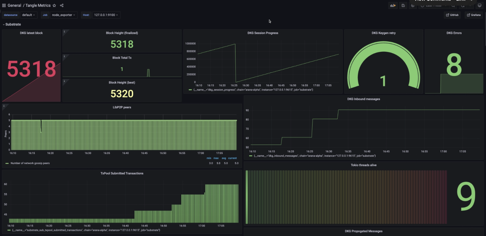

import { Tabs, Tab } from "../../../../../components/Tabs";
import Callout from "../../../../../components/Callout";

# Monitoring Tangle Node

The following is a guide outlining the steps to setup monitoring for an Tangle node. If you do not have Tangle node setup yet, please
review the __How to run an Tangle node__ setup guide [here](https://docs.webb.tools/v1/node-operators/run-tangle-node). It is important to note that
this guide's purpose is to help you get started with monitoring your Tangle node, not to advise on how to setup a node securely. Please
take additional security and privacy measures into consideration.

Here is how our final configuration will look like at the end of this guide.

- **Prometheus** is the central module; it pulls metrics from different sources to provide them to the Grafana dashboard and Alert Manager.
- **Grafana** is the visual dashboard tool that we access from the outside (through SSH tunnel to keep the node secure).
- **Alert Manager** listens to Prometheus metrics and pushes an alert as soon as a threshold is crossed (CPU % usage for example).
- **Tangle Node** natively provides metrics for monitoring.
- **Process exporter** provides processes metrics for the dashboard (optional).
- **Loki** provides log aggregation system and metrics.
- **Promtail** is the agent responsible for gathering logs, and sending them to Loki.

<Callout type="info">
  Running the monitoring stack requires that you are already running the tangle network node with at least the following ports exports:
  - Prometheus : `https://localhost:9615`
</Callout>

## Docker usage

The quickest way to setup monitoring for your node is to use our provided `docker-compose` file. The docker image starts all the above monitoring 
tools with the exception of `Node exporter`. `node-exporter` is ommitted since some metrics are not available when running inside a docker container.

Follow the instructions [here](/prometheus) to start the prometheus node exporter.

### Prerequisites

Before starting the monitoring stack, ensure the configs are setup correctly, 

 - (Optional) Set the `__SLACK_WEBHOOK_URL__` in `alertmanager.yml` to receive slack alerts
 - Ensure the promtail mount path matches your log directory

Note : All containers require connection to the localhost, this behaviour is different in Linux/Windows/Mac, the configs within the `docker-compose` and yml 
files assume a linux environment. Refer [this](https://stackoverflow.com/questions/24319662/from-inside-of-a-docker-container-how-do-i-connect-to-the-localhost-of-the-mach) to make necessary adjustments for your environment.

### Usage

**To start the monitoring stack, run:**

```bash
cd monitoring
docker compose up -d
```

You can then navigate to `http://localhost:3000` to access the Grafana dashboard!

