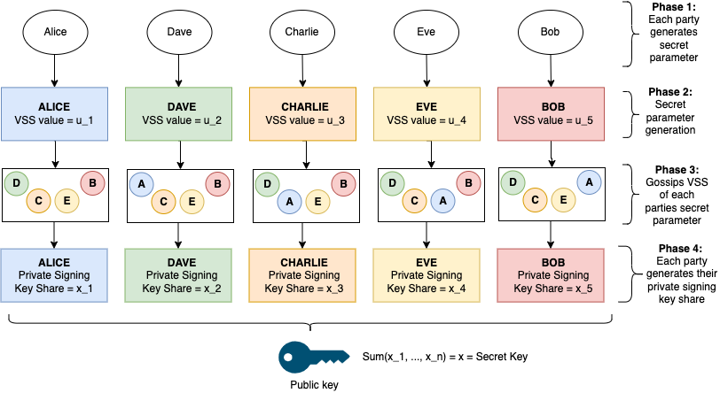
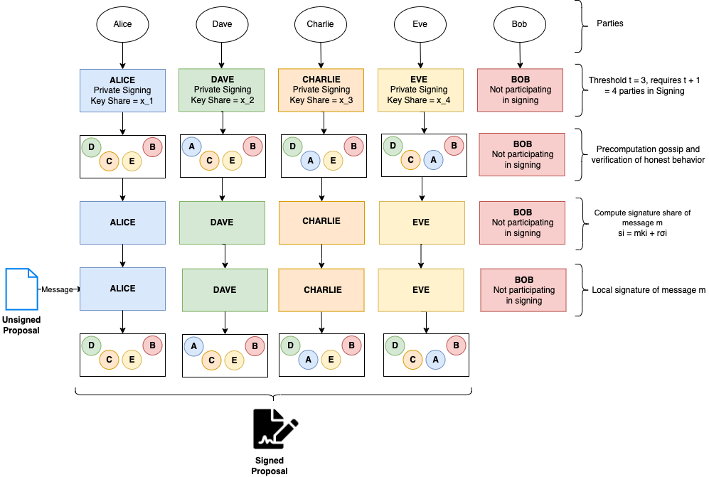

This page will provide an overview of the Distributed Key Generation (DKG) protocol, what it is,
its intended use, and how it interacts with the wider system.

The primary purpose of the DKG protocol is to govern the Anchor protocol. More precisely, the DKG
act as a security instrument to the Anchor protocol, that is, we say that the bridge updates are
valid if they are signed by the DKG. The security of the system then rests on the DKG signing the
actual data that it is meant to sign.

## What is a DKG

A [DKG](https://en.wikipedia.org/wiki/Distributed_key_generation) is a cryptographic process in which
mupliple participants contribute to the calculation of a shared public and private key set in a trustless
manner. In the Webb network, the DKG is comprised of two protocols:

1. Threshold-key-generation
2. Threshold-signature-scheme

The (1) distributed key generation protocol takes a secret parameter as input, and outputs the private signing key (sk) and public key (pk). The returned private signing key (sk) is only a share of the private key, where the values of all returned private signing key shares constitute a (t,n) threshold secret sharing of the private signing key.

The (2) distributed signing protocol takes the private signing key (sk) of each network participant, and the message to be signed (m) as inputs. The output is a valid signature. The public input message are updates (proposals) that are being signed using a threshold-signature-scheme.

The DKG makes use of these distributed key generation and signing protocols to govern distributed applications. Specifically, having arbitrary messages or proposals that represent requested changes to a system to be voted on, and if a simple majority is achieved, to be signed by a threshold of network participants. A valid signature on a proposal would then signal those requested changes to be true.

## How proposals are signed

The below sequence diagram illustrates the steps required to successfully submit an **Anchor Update Proposal**
for signature.

1. Proposers propose an anchor update
2. Proposers vote to either reject or acknowledge the proposal
3. If the majority vote to reject, the execution is canceled and the proposal rejection event is emitted
4. If the majority vote in favour of the proposal, the execution to have that proposal signed begins
5. The proposal is inserted into an Unsigned Proposal Queue
6. The DKG-gadget an offchain service worker, fetches the unsigned proposal from the queue
7. The DKG-gadget sends messages to all connected peers to be signed in the given or next round
8. Upon the completion of the round, the now signed proposals are processed and stored in offchain storage
9. The Proposal-Handlers offchain worker then fetches signed proposals
10. The proposals signatures are validated and inserted into pallet storage
11. A ProposalSigned event is emitted indicating a successfully submitted proposal

The current DKG implementation manages the following proposals, each specify a unique change to the system that must be signed in order for any of these requested updates to be considered valid.

| Proposals                  | Description                          |
| -------------------------- | ------------------------------------ |
| Refresh                    | Request to refresh shared public key |
| AnchorCreate               | Request to create an anchor                                     |
| AnchorUpdate               | Request to update merkle roots       |
| SetVerifierProposal        | Request to set the verifier                                     |
| TokenAdd                   | Request to add token to token wrapper                 |
| TokenRemove                | Request to remove token from token wrapper              |
| WrappingFeeUpdate          | Request to update wrapping fee                |
| RescueToken                | Request to move accumulated fee tokens from the Treasury to a specified address |
| MaxDepositLimitUpdate      | Request to update the maximum deposit limit on the variable anchor system                                     |
| MinWithdrawalLimitUpdate   | Request to update the minimum deposit limit on the variable anchor system                                     |
| FeeRecipientUpdateProposal | Request to update the minimum deposit limit on the variable anchor system                                     |
| SetTreasuryHandlerProposal | Request to set the treasury handler address                                    |
| MaxExtLimitUpdate          |                                      |
| MaxFeeLimitUpdate          |                                      |
| ResourceIdUpdate           | Request to update resource id        |
| ProposalSetUpdate          |                                      |

## Key rotation

On a new session, the new authorities (from validators or collators) are selected and the next authorities
are selected.

1. These next authorities run **_keygen_** protocol and output a new group keypair on-chain, denoted
   `next_dkg_public_key`.
2. The current authorities (having already run this process in the step before) see this event and if
   it is time to refresh, they begin to sign the `next_dkg_public_key` with their key, the `dkg_public_key`.
3. The signature from the active keypair of the next keypair is posted on-chain.
4. Once this signature is posted, anyone can propagate it.
   - Any relayer.
   - Any user who wants to update the governor of their contract.

## Pallets

The DKG runtime is uses the following pallets which are central to how the protocol functions.

### pallet-dkg-metadata

The DKG Metadata pallet manages the following metadata about the DKG and DKG proposal system:

- The active DKG public key
- The active DKG authorities
- The next DKG public key
- The next DKG authorities
- The DKG signature threshold (the t in t-out-of-n threshold signatures)
- The key refresh process
- The misbehavior reporting process
- The pallet tracks authority changes after each session and updates the metadata for the current and 
next authority sets respectively. The pallet also exposes a way for the root origin to update the 
signature threshold used in the DKG signing system.

The pallet is responsible with initiating the key refresh process for rotating the DKG keys across 
authority set changes and executing the rotation when a new session starts.

The pallet tracks reputations of DKG authorities by providing extrinsics and storage for submitting misbehaviour
 reports about authorities that misbehave.

- [Docs](https://webb-tools.github.io/dkg-substrate/pallet_dkg_metadata/index.html)
- [Source](https://github.com/webb-tools/dkg-substrate/tree/master/pallets/dkg-metadata)

### pallet-dkg-proposals

The DKG proposals pallet manages a governance system derived from ChainSafe's ChainBridge Substrate pallet. 
It is designed as the first layer in Webb's DKG governance system and is responsible for managing proposal
 submission and voting for messages that are intended to be signed by the DKG threshold signing protocol.

The pallet implements a simple threshold voting system wherein proposers propose messages to be signed. Once 
a threshold of votes over the same proposal is met, the message is handled by a generic proposal handler. 
This pallet is intended to be used in conjunction with [pallet-dkg-proposal-handler].

- [Docs](https://webb-tools.github.io/dkg-substrate/pallet_dkg_proposals/index.html)
- [Source](https://github.com/webb-tools/dkg-substrate/tree/master/pallets/dkg-proposals)

### pallet-dkg-proposal-handler

The DKG Proposal Handler pallet is the pallet that directly handles the unsigned and signed DKG proposals. 
It is responsible for maintaining the UnsignedProposalQueue that the DKG authorities poll from for initiating
 threshold-signing. It is also responsible for the submission of signed proposals back on-chain, which allows 
 for external relayers to listen and relay the signed proposals to their destinations.

The pallet is meant to be used in conjunction with any governance system that processes unsigned proposals 
either directly or indirectly such as the pallet-dkg-proposals pallet, which delegates successfully voted 
upon proposals to the DKG Proposal Handler for processing. This pallet also contains root-level functions 
that allow for the submission of unsigned proposals that are useful for Webb Protocol applications. The 
intention being that tokenholders of the Webb Protocol chain can vote through the pallet-democracy or a 
similar governance system to submit unsigned proposals relevant for protocols built on the Webb Protocol’s 
interoperable private application platform.

The signed proposals are submitted on-chain through an offchain worker and storage mechanism that is 
maintained locally by each DKG authority. The DKG authorities engage in an offchain multi-party ECDSA 
threshold signing protocol to sign the unsigned proposals. Once the DKG authorities have signed proposals, 
they submit the signed proposals on-chain, where the signatures are verified against the active DKG’s public key.

- [Docs](https://webb-tools.github.io/dkg-substrate/pallet_dkg_proposal_handler/index.html)
- [Source](https://github.com/webb-tools/dkg-substrate/tree/master/pallets/dkg-proposal-handler)
