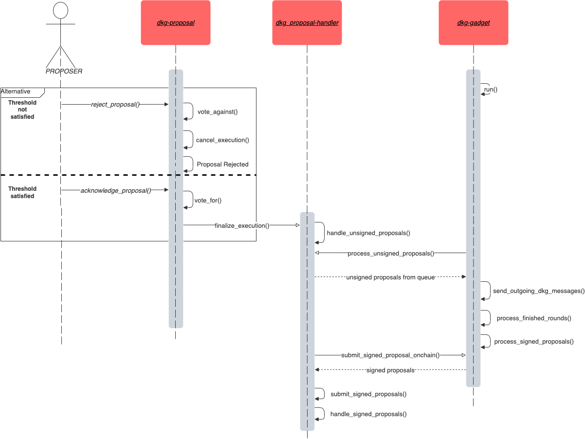

The DKG governance is split between different Substrate pallets that each handle a different aspect of the system.

## Pallets

The DKG runtime is uses the following pallets which are central to how the protocol functions.

### pallet-dkg-metadata

The metadata pallet tracks information about the DKG state. This includes the active and next authority 
sets and their authority set IDs, the active and next DKG public keys, thresholds, historical refreshes, 
and more. It’s main purpose is to provide on-chain information about the DKG and the next DKG for clients 
who are participating in the protocol.

The pallet houses a few sub-protocols, namely:

- The refresh protocol
- The misbehaviour and reputation protocol

One main importance of this pallet is to deterministically identify the best authorities for the next 
DKG’s authority set in order to signal participation to clients in the membership set. This ensures that 
all offchain clients see the same state of the world.

- [Docs](https://webb-tools.github.io/dkg-substrate/pallet_dkg_metadata/index.html)
- [Source](https://github.com/webb-tools/dkg-substrate/tree/master/pallets/dkg-metadata)

### pallet-dkg-proposals

This pallet maintains the valid proposers and the first layer of the governance system: voting on proposals 
to be signed by the DKG. The valid proposers is superset of the current DKG authorities. Active DKG 
authorities are continuously rotated into the proposer set.

This pallet maintains a queue for pending proposals which the DKG authorities vote on and if the vote threshold 
is met, the proposal is passed on to be handled by a type that implements the `ProposalHandlerTrait`. The 
proposals meant to be processed by this pallet are primarily `AnchorUpdateProposals` but can be extended to 
support any type of proposal that is meant to be submitted by the valid proposers.

- [Docs](https://webb-tools.github.io/dkg-substrate/pallet_dkg_proposals/index.html)
- [Source](https://github.com/webb-tools/dkg-substrate/tree/master/pallets/dkg-proposals)

### pallet-dkg-proposal-handler

This pallet implements the `ProposalHandlerTrait` and accepts proposals through this handler system. In the 
current incarnation, the **pallet-dkg-proposals** passes successfully passed unsigned proposals to this pallet 
for queuing for eventual signing by the DKG. All unsigned proposals handled here are added to a queue which each 
DKG client continues to poll from using a runtime API.

Off-chain, unsigned proposals move through the DKG’s threshold signature protocol and eventually, if successful, 
get re-submitted on-chain as signed proposals. The unsigned proposal records are removed and the signed proposals 
are stored in the pallet’s storage for inspection by any observing system, such as an oracle or relayer network.

This pallet represents the second stage in the governance protocol. That is, after the first layer of the governance 
system decides on which proposals to sign, this pallet helps expose those proposals and enable submission of them 
after successful threshold-signing.

- [Docs](https://webb-tools.github.io/dkg-substrate/pallet_dkg_proposal_handler/index.html)
- [Source](https://github.com/webb-tools/dkg-substrate/tree/master/pallets/dkg-proposal-handler)

## Client

The DKG client (or gadget) is the main service that interfaces with the pallet system and overall governance protocol. 
It is responsible for listening to the chain and participating (if selected) in the DKG protocol.

### dkg-gadget

The DKG gadget is an offchain service that executes the DKG protocols and stores data in off-chain storage for the 
on-chain system to fetch and post back on-chain. It also listens to changes in the proposal handler and metadata 
pallets in order to properly:

- Rotate keys
- Sign unsigned proposals
- Set and clear offchain storage
- Report misbehaviours.

We are always executing a DKG signing protocol for the current authority set **and the DKG key generation protocol 
for next authority set if none has completed**.

- [Docs](https://webb-tools.github.io/dkg-substrate/dkg_gadget/index.html)
- [Source](https://github.com/webb-tools/dkg-substrate/tree/master/dkg-gadget)

### **Note on Offchain workers**

The DKG makes use of offchain workers to store data ready for on-chain submission. 

If running a live chain as a validator or collator, please add your sr25519 account keys to the node's local keystore 
either by using the `author_insertKey` RPC or using the `key` subcommand 

```
dkg-standalone-node key insert --key-type acco --scheme sr25519 --suri <path-secret-phrase>
```

> Key Type is `acco` Scheme is sr25519
> 

**Note** For the standalone node the account being added to the keystore should be the Stash account used in staking 
not the Controller account

## How proposals are signed

The below sequence diagram illustrates the steps required to successfully submit an **Anchor Update Proposal**
for signature.

1. Proposers propose an anchor update
2. Proposers vote to either reject or acknowledge the proposal
3. If the majority vote to reject, the execution is canceled and the proposal rejection event is emitted
4. If the majority vote in favour of the proposal, the execution to have that proposal signed begins
5. The proposal is inserted into an Unsigned Proposal Queue
6. The DKG-gadget an offchain service worker, fetches the unsigned proposal from the queue
7. The DKG-gadget sends messages to all connected peers to be signed in the given or next round
8. Upon the completion of the round, the now signed proposals are processed and stored in offchain storage
9. The Proposal-Handlers offchain worker then fetches signed proposals
10. The proposals signatures are validated and inserted into pallet storage
11. A ProposalSigned event is emitted indicating a successfully submitted proposal



## Supported Proposals

The current DKG implementation manages the following proposals, each specify a unique change to the system 
that must be signed in order for any of these requested updates to be considered valid.


| Proposals                  | Description                                             |
| -------------------------- | ------------------------------------------------------- |
| Refresh                    | Proposal to refresh a contract’s governor               |
| AnchorCreate               | Proposal to create a new anchor                         |
| AnchorUpdate               | Proposal to update merkle roots                         |
| SetVerifierProposal        | Proposal to set a verifier address                      |
| TokenAdd                   | Proposal to add token to a set                          |
| TokenRemove                | Proposal to remove token from a set                     |
| WrappingFeeUpdate          | Proposal to update fee parameter                        |
| RescueToken                | Proposal to move tokens from a Treasury                 |
| MaxDepositLimitUpdate      | Proposal to update a maximum deposit limit parameter    |
| MinWithdrawalLimitUpdate   | Proposal to update a minimum withdrawal limit parameter |
| FeeRecipientUpdateProposal | Proposal to update a fee recipient account              |
| SetTreasuryHandlerProposal | Proposal to set a treasury handler address              |
| ResourceIdUpdate           | Proposal to add/update a resource ID                    |
| ProposalSetUpdate          | Proposal to update the latest proposer set state        |

## Key rotation

The DKG required network participants to rotate their shared private signing keys in an effort to keep the 
network secure. On a new session, the new authorities (from validators or collators) are selected and the 
next authorities are selected.

1. These next authorities run ***keygen*** protocol discussed above and output a new group keypair on-chain, 
denoted `next_dkg_public_key`.
2. The current authorities (having already run this process in the step before) see this event and if it is time 
to refresh, they begin to sign the `next_dkg_public_key` with their key, the `dkg_public_key`.
3. The signature from the active keypair of the next keypair is posted on-chain.
4. Once this signature is posted, anyone can propagate it.
    - Any relayer.
    - Any user who wants to update the governor of their contract.

## Authority Selection

The authority selection system for DKG authorities uses a simple reputation mechanism for selecting the best set 
of authorities to participate in the key generation and signing protocols. The integer thresholds for keygen authorities 
and signing authorities are set and governed on-chain and directly correspond to the number of DKG clients that will 
participate in either protocols.

For a keygen threshold of ***n*** and a signing threshold of ***t***, we take the top-***n*** authorities on chain by 
reputation. Out of these ***n*** keygen authorities, ***t+1*** of them are selected for signing. The keygen set remains 
fixed over the course of the session, whereas the signing set can change amidst misbehaviours in signing protocol participation.

## Misbehaviour Reporting & Reputation

Misbehaviour reporting follows an oracle based approach. The DKG protocol we utilize has identifiable aborts, meaning it is 
possible to identify the party misbehaving during the protocol’s execution. While every honest party sees this misbehaviour, 
it is tricky to identify on-chain, as it would require running the protocol itself on-chain and verifying the misbehaviour proof.

Instead of pushing proofs of misbehaviour on-chain, we utilize a threshold voting based approach. For a threshold 
***t*** and offender ***o***, if ***t*** parties report the same misbehaviour containing the type of misbehaviour, the round of 
misbehaviour, and the offending authority, then the party’s reputation reduces according to the function:

```
$reputation(o) = \alpha *reputation(o)$
```

When a good action occurs, such as succesfully rotating keys or signing a proposal and submitting it on-chain. The reputation 
increases according to the function

```
$reputation(o) = \alpha * reputation(o) + 1,000,000,000$
```