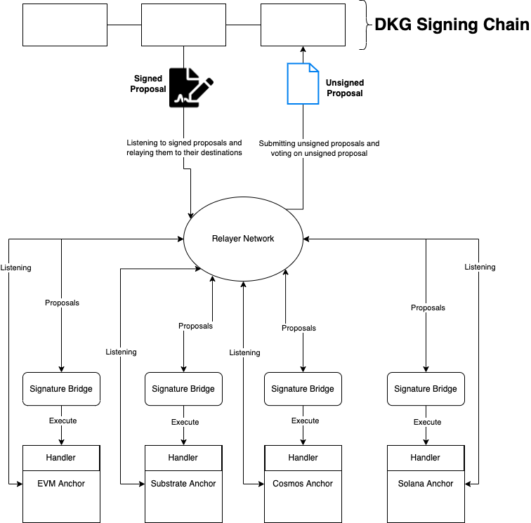

Below is an illustration of how the Anchor protocol interacts with other network participants,
namely the governing DKG, and the relayer network.

**Relayer Responsibilities**

1. Listen for deposits on Anchor implementations
2. Vote on presented proposals
3. Relay signed proposals to Signature bridge

**Signature Bridge Responsibilities**

1. Receive signed proposals
2. Verify signature is valid
3. Parse Signed Proposal data to hand off to appropriate Anchor Handlers

**Anchor Responsibilities**

1. Insert merkle root updates
2. Execute proposals

**DKG Responsibilities**

1. Generate shared keys
2. Sign proposals by generating a valid threshold signature

 

The Webb protocol architecture is modelled off the ChainBridge and Tornado Cash architectures. We merge and
augment both protocols and increase the relayer responsibilities to design our private bridge protocol. The
modifications can be summarized as:

- Augmenting Tornado's into Anchor's which additionally track an edge list to other Anchors.
  - Anchors are private transaction systems that function both as Tornados but also as cross-chain bridges.
  - Anchors use a zero-knowledge one-of-many merkle tree membership proof instead of one for a single merkle tree.
  - Anchors can mint/burn the underlying token being deposited and withdrawn.
- Augmenting ChainBridge's Bridge into a private bridge protocol.
  - We create a new AnchorHandler which modifiers the edge list of Anchors needing updates.
  - We augment the Bridge relayers w/ a multi-party threshold signing scheme, so that one or many threshold
    networks can govern the bridge.

## Further reading

- [Chainbridge Documentation](https://chainbridge.chainsafe.io/)
- [Chainbridge Implementation](https://github.com/ChainSafe/ChainBridge)
- [Tornado Cash Documentation](https://docs.tornado.cash/general/readme)
- [Tornado Cash Implementation](https://github.com/tornadocash)
