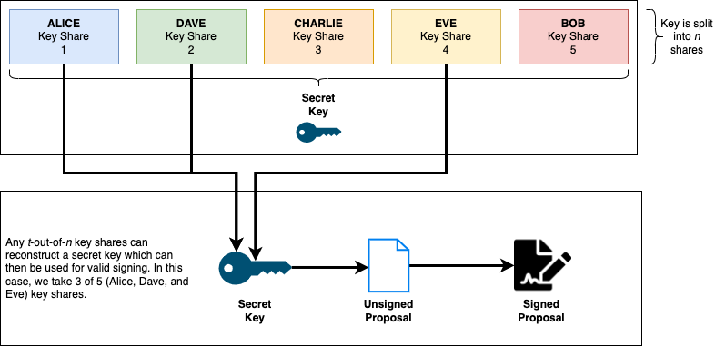
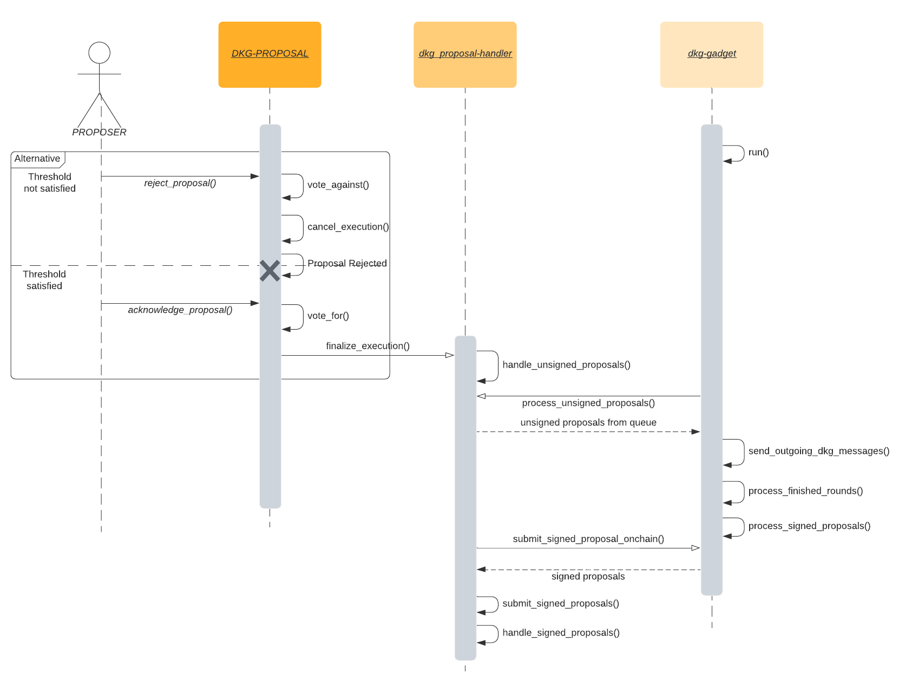

This page will provide an overview of the Distributed Key Generation (DKG) protocol, what it is, its intended use, and how it interacts with the wider system.

The primary purpose of the DKG protocol is to govern the Anchor protocol. More precisely, the DKG act as a security instrument to the Anchor protocol, that is,
we say that the bridge updates are valid if they are signed by the DKG. The security of the system then rests on the DKG signing the actual data that it is meant to sign.

## What is a DKG

A [DKG](https://en.wikipedia.org/wiki/Distributed_key_generation) is a cryptographic process in which mupliple participants contribute to the calculation of a shared public and private key set in a trustless manner. In
the Webb protocol the DKG is signing these updates (proposals) using a [threshold-signature-scheme](https://en.wikipedia.org/wiki/Threshold_cryptosystem). The below diagram provides a simplified illustration of the DKG.

### DKG Key Generation

TODO: describe DKG key generation and diagram

### DKG Signature Verification

## How proposals are signed

The below sequence diagram illustrates the steps required to successfully submit an **Anchor Update Proposal** for signature.

1. Proposers propose an anchor update
2. Proposers vote to either reject or acknowledge the proposal
3. If the majority vote to reject, the execution is canceled and the proposal rejection event is emitted
4. If the majority vote in favour of the proposal, the execution to have that proposal signed begins
5. The proposal is inserted into an Unsigned Proposal Queue
6. The DKG-gadget an offchain service worker, fetches the unsigned proposal from the queue
7. The DKG-gadget sends messages to all connected peers to be signed in the given or next round
8. Upon the completion of the round, the now signed proposals are processed and stored in offchain storage
9. The Proposal-Handlers offchain worker then fetches signed proposals
10. The proposals signatures are validated and inserted into pallet storage
11. A ProposalSigned event is emitted indicating a successfully submitted proposal

## Pallets: TODO add pallet doc links and source code links

The DKG runtime is uses the following pallets which are central to how the protocol functions.

### pallet-dkg-metadata

This pallet essentially tracks the information about the current and next authority sets, including the set Ids.
It does this by implementing the `OneSessionHandler` trait which allows it to receieve both new and queued authority sets when the session changes.

### pallet-parachain-staking

This is a custom staking pallet that handles collator selection, This pallet helps the protocol select new collators based on amount staked.
It also allows for nominators, who back collators by staking their assets, both collators and nominators are rewarded after every session comes to an end.
Reward for collators and their nominators is dependent on how many points accrued by the collator during the session,
these points are gained by successfully authoring blocks.

This pallet implements the `SessionManager` trait and that way is able to provide the the selected collators as validators to the session pallet.

### pallet-dkg-proposals

This pallet handles maintaining valid proposers and also voting on proposals.
The valid set of proposers is equivalent to the current DKG authorities. This pallet gains access to the current DKG authorities by
implementing the `OnAuthoritySetChangedHandler` trait, that way it is able to receive the updated DKG authorities from `pallet-dkg-metadata`.

This pallet maintains a queue for pending proposals which the DKG authorities vote on and if the vote threshold is met, the proposal is passed on to be handled
by a type that implements the `ProposalHandlerTrait`.

In this current iteration the proposals are Ethereum transactions.

### pallet-dkg-proposal-handler

This pallet implements the `ProposalHandlerTrait` accepts proposals and signs them using the DKG authority keys.

### pallet-dkg-mmr

This pallet serves as a leaf provider for the `pallet-mmr`, generating leaf data that contains a merke root hash for a particular authority set.

It also provides a type that has an implementation for converting `ECDSA` keys to ethereum compatible keys.

### Note on Offchain workers

The DKG makes use of offchain workers to submit some extrinsics back on chain and the runtime validates that the origin of such extrinsics is part of the active or queued authoritiy set, if running a development node or a local test net, the sr25519 account keys
for the predefined validators Alice, Bob, etc, have been added to the keystore for convenience.

If running a live chain as a validator or collator, please add your sr25519 account keys to the node's local keystore either by using the `author_insertKey` RPC or using the `key` subcommand (`dkg-standalone-node key insert --key-type acco --scheme sr25519 --suri <path-secret-phrase>`) of the node cli

> Key Type is acco
> Scheme is sr25519

**Note**
For the standalone node the account being added to the keystore should be the Stash account used in staking not the Controller account
