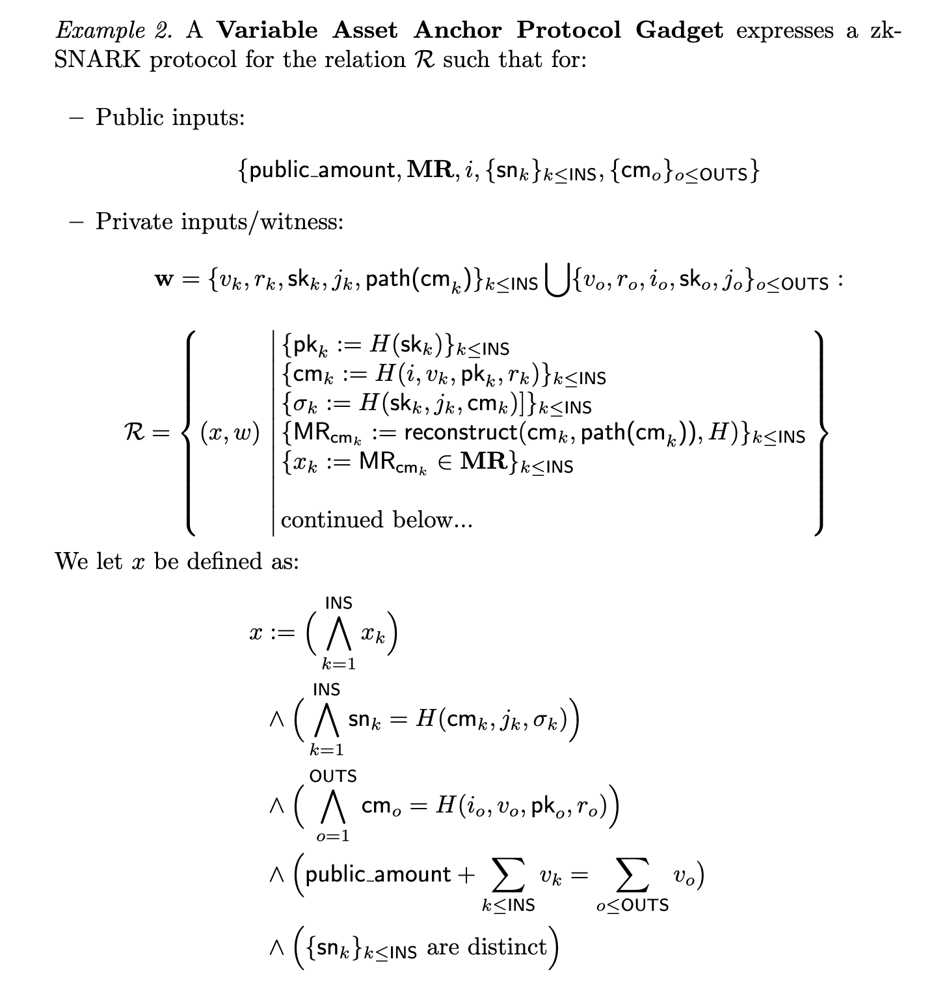

The asset protocol we describe here is inspired and based off of Tornado Pool, a shielded pool protocol that allows for private and arbitrary valued transactions using a shielded unspent transaction output (UTXO) model.

In our version of the asset protocol we will leverage Webb’s technology to design an interoperable shielded pool that allows both shielded transactions on a single chain as well as across chain in a single design.

### UTXO model

The UTXO model for user balances is one predicated on the UTXO data structure. Each UTXO stores, among other things, a value that represents the amount of funds that can be spent and effectively transferred to another UTXO. UTXOs can be split by breaking this value into multiple parts, creating many UTXOs from one. We refer to this action as *spending* a UTXO and *splitting* its outputs.

We will refer to *shielded* UTXOs as UTXOs for which we use collision-resistant hash commitments to reference them. Shielded UTXOs are hidden UTXOs because an outside observer will only see the hash commitment of the UTXO and no underlying data. We will describe later on how we *spend* shielded UTXOs using only these hashes.

For a given UTXO system, we will refer to the UTXO set as the set of all unspent transaction outputs. We will maintain the set of all spent and unspent transaction outputs in a merkle tree for efficient storage and proofs of membership and we will assume the existence of a method that allows us to check whether a transaction output has been spent or is otherwise unspent.

### Shielded UTXO model

In the shielded UTXO model the UTXO set is maintained as a merkle tree of commitments to the hidden UTXOs. In order to spend shielded UTXOs, we require a valid zero-knowledge proof that satisfies a variety of constraints, namely:

- The sum of inputs equals the sum of outputs.
- The UTXOs and their shielded commitments are well-formed.
- The UTXOs being spent are unique.

The reason we must require a proof of a variety of constraints is because a spend of shielded UTXOs hides information about the UTXOs themselves! Therefore, we must require the spender to generate a zero-knowledge proof that proves to the overall system that no malicious or otherwise improper changes take place. From this, we get a way to spend UTXOs without disclosing the contents of these UTXOs, enabling private transactions on a public blockchain.

### Interoperable UTXO model

In Webb’s asset protocol, we will leverage the Anchor Protocol to manage a connected set of shielded UTXO sets. Each shielded UTXO set will live on its respective chain and will maintain knowledge of its connections through the Anchor Protocol’s edge list data structure. Anchor’s in this protocol instance directly map to shielded UTXO sets and so we will extend the generic anchor with the capabilities to maintain a shielded transaction system, that is merkle trees of anchors become shielded UTXO sets. An Asset Protocol API augments the standard Anchor Protocol API to provide the new functionality.

## Data Structures

The main data structure presented here is the ***shielded UTXO***. A shielded UTXO contains:

- **Chain identifier**
    - A unique identifier for the blockchain where the UTXO can be spent.
- **Amount**
    - A numerical identifier for the amount of funds the UTXO represents.
- **Public key**
    - A public key pair
- **Blinding randomness**
    - A random value that provides additional randomization to the hash commitment.

The ***shielded*** component comes from the hash commitment to the UTXO data. We take the commitment to be the Poseidon hash function of the underlying data.
```
commitment = Poseidon(chain_id, amount, public_key, blinding)
```
We will also define a signature and nullifier that allows us to indicate if a UTXO has been spent. We take them to be Poseidon hash functions of various pieces of data.
```
signature = Poseidon(private_key, commitment, path_index)

nullifier = Poseidon(commitment, path_index, signature) 
```

## API

The Asset Protocol API extends the Anchor Protocol API and adds the following functionality:

- **`transact(public_amount, input_nullifiers, output_commitments, zk_proof)`**
    - `public_amount` - a signed integer value for adding or removing funds from pool
    - `input_nullifiers` - identifying data about input UTXOs being spent
    - `output_commitments` - outputs commitments for new UTXOs to insert into the pool
    - `zk_proof` - a zero-knowledge proof of the transactions validity

The protocol assumes the existence of public input variables that are globally available, namely the same values provided by the Anchor Protocol. The required global variables are:

- **Roots** - The set of merkle roots for the bridged anchors provided by the Anchor Protocol
- **Chain Id** - The active chain ID provided ideally through an un-tamperable opcode.

## Circuit

The zero-knowledge circuit encodes a variety of constraints to ensure that the asset transfer system works properly. This includes, among other things, the constraints necessary for preventing double spending across chains.

The constraints required are:

- To verify the correctness of input nullifiers
- To verify the uniqueness of input nullifiers
- To verify the existence of input commitments
- To verify correctness of output commitments
- To verify ***the sum of input amounts and public amount*** = ***the sum of output amounts***

### Formal description



## References

- [https://github.com/tornadocash/tornado-pool](https://github.com/tornadocash/tornado-pool)
- [https://en.wikipedia.org/wiki/Unspent_transaction_output](https://en.wikipedia.org/wiki/Unspent_transaction_output)