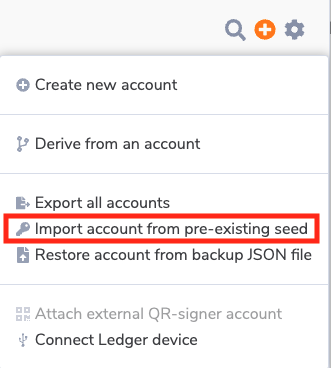
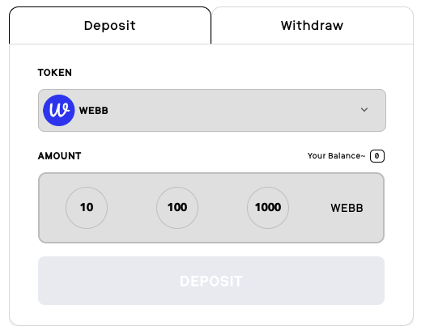
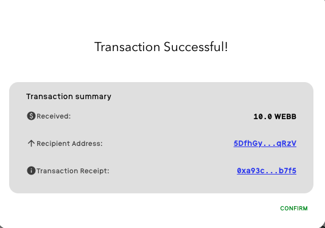

This guide provides instructions on how to setup a Substrate mixer locally and explains how to interact with the DApp to deposit and withdraw funds from the mixer.

## Local Substrate Mixer Usage

The following guide outlines the steps necessary to utilize the Substrate mixer locally with a local relayer, and local Webb DApp. Follow the below steps to get up and running. 🏃

### Run local protocol-substrate nodes

1. Clone the [protocol-substrate repo](https://github.com/webb-tools/protocol-substrate):
```bash
 git clone https://github.com/webb-tools/protocol-substrate --depth 1
```

2. We are using [ORML](https://github.com/open-web3-stack/open-runtime-module-library/tree/a5ee7866c763efbd3afe0cd81fec54cede83a65f) fork, and fixed zero knowledge keys to run the mixers. **Run:**
```bash
# populates fixed zero knowledge keys
git submodule update --init
```

3. Build the `webb-standalone-node` by running:

```bash
cargo build --release -p webb-standalone-node
```

4. Startup two standalone nodes in other terminal instances:

```bash
# Run in terminal 1
./target/release/webb-standalone-node --dev --alice --node-key 0000000000000000000000000000000000000000000000000000000000000001 --ws-port=9944 --rpc-cors all

# Run in terminal 2
./target/release/webb-standalone-node --dev --bob --port 33334 --tmp --bootnodes /ip4/127.0.0.1/tcp/30333/p2p/12D3KooWEyoppNCUx8Yx66oV9fJnriXwCcXwDDUA2kj6vnc6iDEp
```

Great! Now you have 2 local protocol-substrate nodes running! Now let's setup a local relayer. 🚀

### Run local relayer

1. Clone the [relayer repo](https://github.com/webb-tools/relayer):

```bash
git clone https://github.com/webb-tools/relayer.git --depth 1
```

2. Build the relayer:
```bash
cargo build --release
```

3. Run with the local substrate configuration:
```
./target/release/webb-relayer -c config/local-substrate -vv
```

Congrats! 🎉  You now have a local relayer running and listening on localhost:9955 !

### Run local Webb DApp

The last step is to run the local Webb DApp.

1. Clone the [Webb DApp repo](https://github.com/webb-tools/webb-dapp).

```bash
git clone git@github.com:webb-tools/webb-dapp.git --depth 1 && cd webb-dapp
```

2. Install dependencies by `yarn`

```bash
yarn install
```

3. Start the dapp:

```bash
yarn start:dapp
```

Visit http://localhost:3000/ to see the Webb Dapp UI! 🕸️ 🚀 

## Using the mixer from the DApp 

The first thing you will want to do is add `Alice` or `Bob` development accounts to your polkadot.js wallet. These accounts are pre-seeded with funds that we will use 
to demonstrate the mixer. To add these accounts, please ensure you have installed the [polkadot.js extension](https://polkadot.js.org/extension/). For more information on these development accounts
please read the documentation [here](https://docs.substrate.io/v3/tools/subkey/#well-known-keys).

Accounts like Alice, Bob, Ferdie etc are derived from a pre-known development seed. To add the accounts to your wallet, select the extension and click on the + button. 
Then select "Import account from pre-existing seed". 




The seed to input will be the following:

```
bottom drive obey lake curtain smoke basket hold race lonely fit walk.
```

Now that you have an account with funds lets move on to interacting with the mixer in the UI! 

The below steps will guide you through interacting with the Webb DApp to connect your polkadot.js wallet, deposit funds into the mixer,
 and then withdraw funds from the mixer.

### Connecting polkadot.js wallet 

1. Select the **Mixer** from the side navigation 
2. Select a network
3. Under "Step 1: Select a chain", select the **Protocol Substrate Development** chain
4. Connect polkadot.js wallet
5. Authorize the DApp to connect

### Depositing funds into the mixer 

1. The mixer interface should now be visible similar to the below images



2. Select the amount 10 to deposit 10 Webb tokens in to the mixer
3. Select **Deposit**

### Storing your secret note

In order to withdraw your deposited funds, you must have access to your generated secret note.

1. Download and copy your generated secret note
2. Confirm that you have backed up your note
3. Select **Deposit** 

### Withdrawing funds from the mixer

Switch to the **Withdraw** tab to withdraw funds from the mixer.

1. Paste your secret note into the **Secret Note** field
2. Select the **Relayer** option to use our locally running relayer
3. From the drop down menu, select the relayer url (e.g. http://localhost:9955) and exit the relayer configuration screen
4. Paste in a recipient address to send the funds to
5. Select Withdraw

The transaction will then begin being processed, generating a zero knowledge proof and send the transaction to the relayer for withdrawal. At the 
end you should see a successful transaction screen. 



Congratulations you have successfully withdrawn your funds from the mixer! 🎉