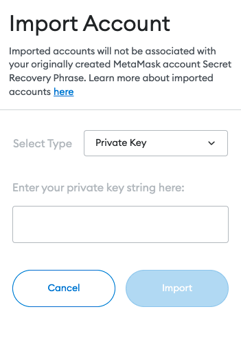
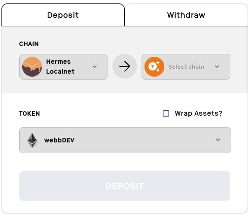
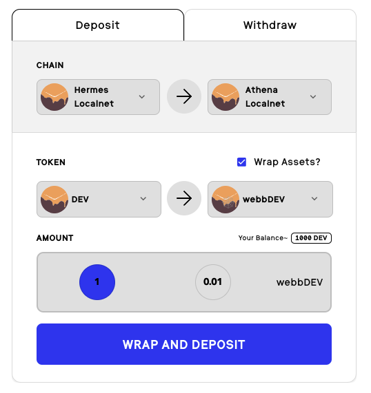

This guide provides instructions on how to setup a EVM bridge locally and explains how to interact with the DApp to deposit and withdraw funds from the bridge.

## Local EVM Bridge Usage

The following guide outlines the steps necessary to utilize the EVM bridge locally with a local relayer, and local Webb DApp. Follow the below steps to get up and running. 🏃

### Run local EVM nodes

1. Clone the [evm-localnet repo](https://github.com/webb-tools/evm-localnet):

```bash
 git clone https://github.com/webb-tools/evm-localnet --depth 1
```

2. We are using zero knowledge key fixtures to generate proofs. **Run:**

```bash
# populates fixed zero knowledge keys
git submodule update --init
```

3. Install the dependencies

```bash
yarn install
```

4. Start the local testnet:

```bash
yarn start
```

Great! Now you have local EVM testnet running! Now let's setup a local relayer. 🚀

### Run local relayer

1. Clone the [relayer repo](https://github.com/webb-tools/relayer):

```bash
git clone https://github.com/webb-tools/relayer.git --depth 1
```

2. Build the relayer:

```bash
cargo build --release
```

3. Add `.env` file to the root directory:

```bash
WEBB_EVM_ATHENA_ENABLED=true
WEBB_EVM_DEMETER_ENABLED=true
WEBB_EVM_HERMES_ENABLED=true
ATHENA_PRIVATE_KEY=0x0000000000000000000000000000000000000000000000000000000000000001
HERMES_PRIVATE_KEY=0x0000000000000000000000000000000000000000000000000000000000000001
DEMETER_PRIVATE_KEY=0x0000000000000000000000000000000000000000000000000000000000000001
```

3. Run with the local evm testnet configuration:

```
./target/release/webb-relayer -c config/evm-localnet -vv
```

Congrats! 🎉 You now have a local relayer running and listening on localhost:9955 !

### Run local Webb DApp

The last step is to run the local Webb DApp.

1. Clone the [Webb DApp repo](https://github.com/webb-tools/webb-dapp).

```bash
git clone git@github.com:webb-tools/webb-dapp.git --depth 1 && cd webb-dapp
```

2. Install dependencies by `yarn`

```bash
yarn install
```

3. Start the dapp:

```bash
yarn start:dapp
```

Visit http://localhost:3000/ to see the Webb Dapp UI! 🕸️ 🚀

## Using the bridge from the DApp

The first thing you will want to do is add the pre-seeded development accounts to your MetaMask wallet. These accounts are pre-seeded with funds that we will use
to demonstrate the EVM bridge. To add these accounts, please ensure you have installed the [MetaMask extension](https://metamask.io/).

To add the accounts to your wallet, select the extension and click on the account thumbnail.
Then select "Import account".



The private key to input will be the following:

```
0x0000000000000000000000000000000000000000000000000000000000000001
```

You may add additional accounts with the following private keys:

```
0x0000000000000000000000000000000000000000000000000000000000000002
0xc0d375903fd6f6ad3edafc2c5428900c0757ce1da10e5dd864fe387b32b91d7e
```

Now that you have an account with funds lets move on to interacting with the bridge in the UI!

The below steps will guide you through interacting with the Webb DApp to connect your MetaMask wallet, deposit funds into the bridge,
and then withdraw funds from the bridge.

### Connecting MetaMask wallet

1. Select the **Bridge** from the side navigation
2. Select a network
3. Under "Step 1: Select a chain", select the **Hermes Localnet** chain
4. Connect MetaMask wallet
5. Authorize the DApp to connect

### Depositing funds into the bridge

1. The bridge interface should now be visible similar to the below images



2. Select the destination chain from the dropdown (e.g. Athena Localnet)
3. Since this is a fixed anchor bridge we must select the fixed amount available, 1
4. Select **Deposit**

If you would like to see how wrapped asset deposits work you may proceed with the following steps:

1. Select the destination chain from the dropdown (e.g. Athena Localnet)
2. Select the "Wrap Assets?" checkbox
3. From the Token dropdown, select "Dev" -> webbDev
4. Select the amount to wrap
5. Select **Wrap and Deposit**



### Storing your secret note

In order to withdraw your deposited funds, you must have access to your generated secret note.

1. Download and copy your generated secret note
2. Confirm that you have backed up your note
3. Select **Deposit**

### Withdrawing funds from the bridge

Switch to the **Withdraw** tab to withdraw funds from the bridge.

1. Paste your secret note into the **Secret Note** field
2. Select the **Relayer** option to use our locally running relayer
3. From the drop down menu, select the relayer url (e.g. http://localhost:9955) and exit the relayer configuration screen
4. Paste in a recipient address to send the funds to
5. Select Withdraw (you may need to switch networks to withdraw)

The transaction will then begin being processed, generating a zero knowledge proof and send the transaction to the relayer for withdrawal. At the
end you should see a successful transaction screen.


Congratulations you have successfully withdrawn your funds from the bridge! 🎉
